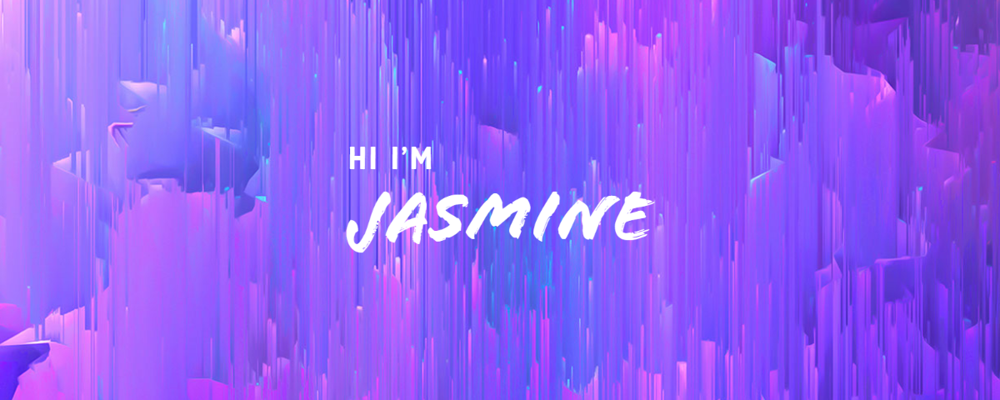

### 

I'm a software developer with a passion for creating innovative solutions and building user-friendly applications. Before transitioning to tech, I worked in mergers and acquisitions, where I gained a deep understanding of business operations and strategy.

My experience in M&A taught me the importance of clear communication, attention to detail, and a results-driven mindset. These skills have translated seamlessly into my work as a software developer, where I strive to deliver high-quality code that meets both the needs of users and the goals of the business.

Currently, I am exploring various technologies and tools to broaden my skillset and enhance my knowledge of the industry. I'm particularly interested in creating applications that prioritize user experience. To achieve this, I am learning how to make use of a variety of techniques, including user-centered design principles and responsive layouts. As someone who is new to the induatry, my goal is to stay up-to-date with the latest industry trends and best practices to ensure that my applications are not only functional but also aesthetically pleasing.

When I'm not coding, you can find me watching scary movies, baking, or playing dinosaurs with my kiddos.

Feel free to check out my portfolio and reach out to connect or collaborate! 🤝
